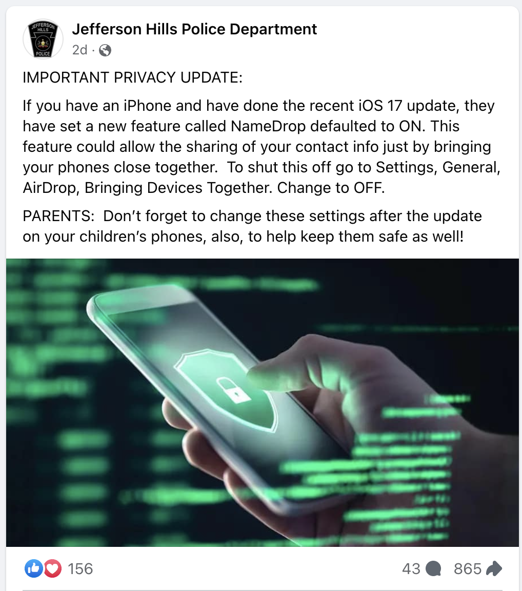
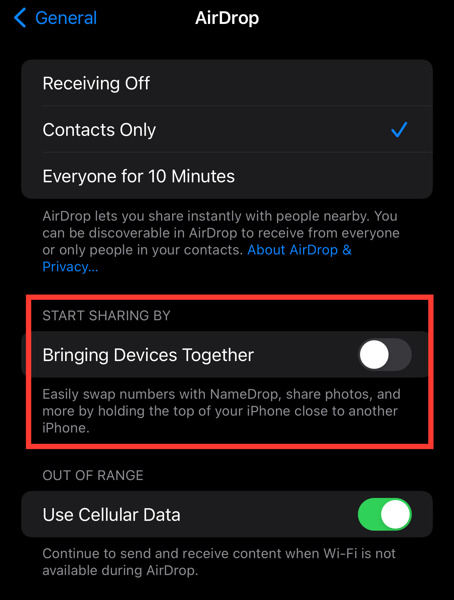

Apple's iOS 17 includes a new feature called [NameDrop](https://support.apple.com/guide/iphone/namedrop-iphone-share-contact-info-iph1b6c664b7/ios). When enabled, you can easily share your contact information (such as your name and phone number) with another person, by physically tapping your iPhones or Apple Watches together.

Over this past weekend, several local police departments in the United States published warnings about this feature on Facebook. The posts claim that NameDrop is a privacy concern, and urge users to turn it off, implying that it enables your phone to share your contact information without your consent. Specifically, they warn parents to disable NameDrop on their kids' phones.

These warnings have been widely reshared across Facebook, LinkedIn, and other social networks. They have also been broadcast by many local news outlets.

# How does NameDrop work?

In order to use NameDrop:
- Both phones must be running iOS 17 or later, and both must have the feature enabled. NameDrop is enabled by default.
- Both phones must be unlocked. NameDrop will not trigger while your phone is locked, such as when it's in your pocket or sitting idle on a table.
- The two phones must be very close together, with their top edges nearly touching. NameDrop uses the iPhone's Near Field Communication (NFC) antenna, which has an extremely short range.

Once the two phones see each other, a confirmation screen will appear on both. In order for NameDrop to complete, the sender must confirm which contact info they'd like to share, and the recipient must confirm that they'd like to receive it.

All of these conditions, working together, make it very difficult to activate NameDrop by accident. Your phone is not broadcasting your contact info to everyone you pass on the street, and it won't allow someone to steal your phone number just by walking close to you.

# Should I disable NameDrop?

That's up to you!

I believe that NameDrop is perfectly safe to use, and that the warnings being posted on social media are overblown. However, if you don't find the feature useful, it's easy to turn it off:

1. Open the Settings app on your iPhone.
2. Select `General`, then `AirDrop`.
3. Turn off the switch labeled `Bringing Devices Together`.

# A real privacy tip: how to quickly lock down your iPhone

I have no idea why police departments are so eager to share this warning about NameDrop, or why they're misrepresenting the facts about it. Frankly, I think it's pretty irresponsible of them to create all this panic over nothing. However, since we're discussing physical threats to your phone, I'd like to share a more practical bit of advice. 

If you're in a situation where someone is trying to take your iPhone from you and search through it, you can take quick action to make it more difficult for them.

Simply hold down the Power button, and either of the two Volume buttons, until the "Slide to Power Off" menu appears. As soon as this menu pops up, your iPhone takes two actions behind the scenes to prevent unauthorized access to your data:
- Touch ID and Face ID are disabled, until you enter your passcode. This will prevent someone from forcing you to unlock your phone.
- Data transfer over Lightning or USB-C is disabled, until you enter your passcode. This prevents someone from using a computer to copy data from your phone.
